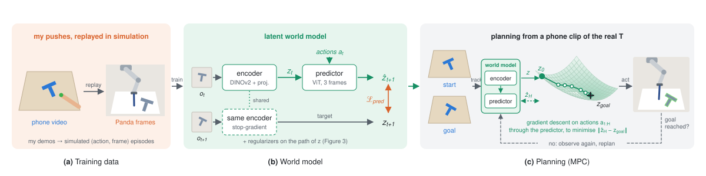
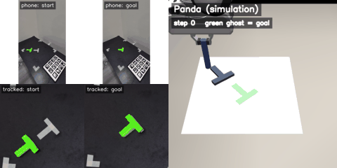
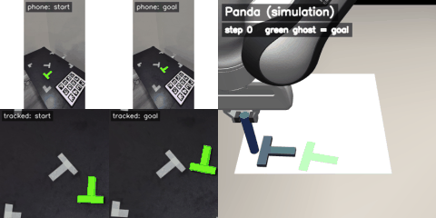
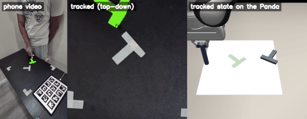
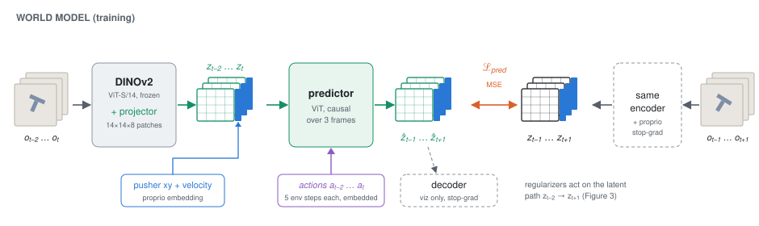
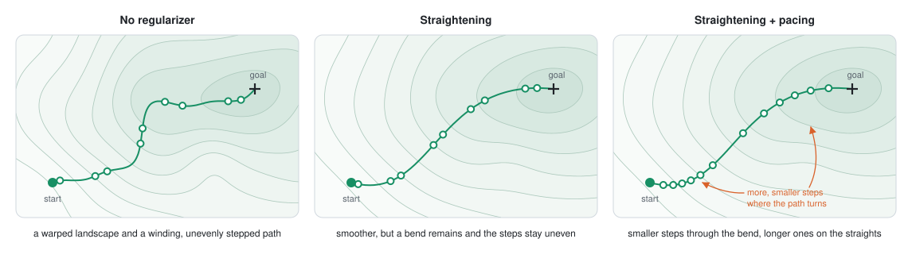
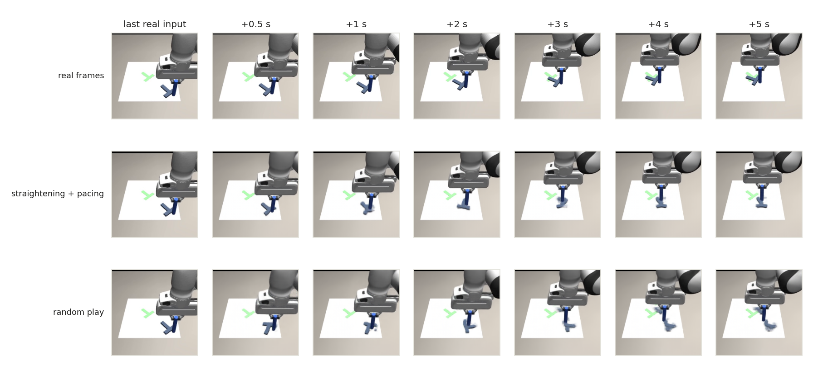

# Humanoid Robot Learning Research Internship Challenge


The goal of this challenge is to drive a robotic manipulator in a simple simulation environment using data that we've recorded manually. My own research area is planning with world models, however, before attempting this challenge I had never collected data for planning. Many questions came to mind as i worked on this, how would simulating random actions work as opposed to manually creating simulation data? What kind of augmentation strategies would work well for planning data? I aim to answer these questions in my work.

<p align="center">
  <br>
  <em><b>Figure 1.</b> A summary of my pipeline. (a) My pushes, replayed in the simulator and rendered with a Panda, are the
  training data. (b) A latent world model learns to predict the next latent from an action.
  (c) At test time, a phone clip of a start and a goal pose sets the task, and the Panda arm plans in
  latent space, replanning until the goal is reached.</em>
</p>

**DEMO:**
<!-- Headline demos: python -m phone2panda.make_demo_videos --run plan_outputs/photo/both --out docs/media -->
<p align="center">
  <br>
  <br>
  <em>Left: the start and goal as my phone filmed them (top) and as the tracker sees them from
  above (bottom). Right: the Panda carrying out the world model's plan in simulation; the green
  ghost is the goal. Full-resolution clips with my own push alongside: <code>docs/media/photo_&lt;k&gt;.mp4</code>.</em>
</p>

I chose a task that involved pushing a T shaped block on a table with a cylindrical pusher. I collected data and trained a world model to predict the next latent state given a current state and an action. This action conditioned representation is used for planning. An optimization algorithm (I chose gradient descent) finds the set of actions that minimize the distance to the goal state representation. Its crucial that the latent space for planning is well conditioned and easy to plan in. I use two regularizers in my work to encourage this, a straightening regulariser [(Wang et. al 2026)](#references) and a pacing regulariser (my own contribution).


**State space:** The simulator's state is 7 numbers: the pusher's position (x, y), the T's position (x, y) and angle, and the pusher's velocity. The world model sees a 224 × 224 image of the Panda scene, plus the pusher's position and velocity. The full state is used only to replay my demos and to score the result.

**Action space:** An action is a 2-D move of the pusher's target position, in units of 100
  (a relative action). A PD controller drives the pusher toward that target.

**Goal:** A goal is an image of the scene where the T should end up.


## Setup and Run

Planning was tested on Linux with an NVIDIA RTX 3050ti 4GB VRAM Laptop GPU.

**1. Install.**

```bash
git clone https://github.com/05kashyap/humanoid-wm && cd humanoid-wm
conda env create -f environment.yaml && conda activate ts
bash phone2panda/install.sh        # Push-T human env, MuJoCo 3 + OpenCV, clones MuJoCo Menagerie (the Panda)
```

The planner's environment imports also need MuJoCo 2.1 (for `mujoco_py`):

```bash
mkdir -p ~/.mujoco && cd ~/.mujoco
wget https://mujoco.org/download/mujoco210-linux-x86_64.tar.gz && tar -xzf mujoco210-linux-x86_64.tar.gz && cd -
echo 'export LD_LIBRARY_PATH=$LD_LIBRARY_PATH:$HOME/.mujoco/mujoco210/bin:/usr/lib/nvidia' >> ~/.bashrc && source ~/.bashrc
```

**2. Download the data and weights** from [Google Drive](https://drive.google.com/drive/folders/1VVNeAaviVchl-UCKkBpaDxX7NfUP3RmZ?usp=drive_link). The folder holds:

```
data/              datasets (pusht_human_aug, pusht_human_branch, pusht_human_random, ...)
checkpoints/       one folder per model: humanai_<model>/hydra.yaml and checkpoints/model_latest.pth
plan_targets/      the exact task sets used for every table below, and the photo goals for the demo
```

Copy `plan_targets/` into the repository root and point the code at the other two:

```bash
export DATASET_DIR=/path/to/data              # planning reads the held-out demos from here
export CKPT=/path/to/checkpoints
export MENAGERIE_DIR=$PWD/third_party/mujoco_menagerie
export MUJOCO_GL=egl                          # osmesa on a machine without a GPU
```

**3. Plan.** Each model is named by its checkpoint folder without the `humanai_` prefix
(`both` is straightening + pacing, `branch` is my demos + branch rollouts):

```bash
bash run_scripts/plan_eval.sh ol both branch      # open loop, 200 tasks
bash run_scripts/plan_eval.sh cl both branch      # closed loop (MPC), the first 50 tasks
bash run_scripts/plan_eval.sh photo both          # goals filmed on my table (the demo above)
python -m phone2panda.make_demo_videos --run plan_outputs/photo/both --out docs/media
python helpers/update_readme.py
```

## Data Collection

<p align="center">
  <br>
  <em>Sample recording: the phone video, the top-down view with the
  tracker's fits (green T outline, red fingertip), and that tracked state placed on the Panda.</em>
</p>

The setup on my desk:
- A cardboard T with an 8 × 2 cm bar, inside a 34 cm square of masking tape, one cm is 15
  units of the simulator's 512-unit arena. There is a guide T masking tape stuck to the table too for my reference while recording the dataset.
- Blue tape on my fingertip.
- An iPad beside the square shows a grid of ArUco markers. (A printout would've been better as it would sit flat to the surface but I had time constraints)
- The phone sits in a fixed spot, looking down at an angle.

Each frame is warped to a top-down view using the Aruco markers, which also undoes small bumps to the phone. The T's pose comes from fitting the simulator's T
  outline to the T-coloured pixels.

**In total I recorded 100 demos. 20 of them are held out and never used for training. The collected data and checkpoints can be found [Here](https://drive.google.com/drive/folders/1VVNeAaviVchl-UCKkBpaDxX7NfUP3RmZ?usp=drive_link)**

Each simulator state is drawn with a Franka Panda from MuJoCo Menagerie, which holds a rod at the pusher position. The simulator gets my fingertip's path as the pusher's commands and decides for itself what happens to the T. Every training episode is then a physically consistent pair of actions and outcomes. I fitted the simulator's damping so that replays end where my real T ended.

It's infeasible to collect enough data to train manually, so I explored some data augmentation strategies:
1. **Augmentation:** jitter the T's start pose, mirror the scene (the T is symmetric about its
  stem), add noise to the path, retime it.
2. **Branch rollouts:** replay a demo up to a random moment, then push randomly from there.
Every variant is re-simulated, never edited in pixel space.


## The model

<p align="center">
  <br>
  <em><b>Figure 2.</b> Each of three frames passes through frozen DINOv2 and a small trainable
  projector; its patches are joined with an embedding of the pusher's position and velocity to form z.
  A causal ViT, given the actions, predicts the next latent of every frame, against the
  same encoder's latents of the following frames (stop-gradient). The decoder is only for viewing
  predictions. The path the latents trace is regularized (Figure 3).</em>
</p>

The world model is the one from DINO-WM and Temporal Straightening, which this repository
extends. A frozen DINOv2 encoder provides features, a small trainable projector reduces them,
and a transformer predicts the next latent from the last three latents and the actions.

### Shaping the latent space

<p align="center">
  <br>
  <em><b>Figure 3.</b> Simplified visualisation of the planner's objective around a latent path from start to goal (darker is
  closer to the goal); dots are the steps the model takes. Straightening smooths the landscape,
  but a bend remains. Pacing puts more, smaller steps through the bend.</em>
</p>

The planner never sees images, only the latent space, so the conditioning of that space determines how
easy planning is.

- **Straightening** ([Temporal Straightening](#references)) penalizes turns in the latent path.
  When paths bend, the straight-line distance to the goal, which the planner minimizes, stops
  measuring progress. Straighter paths make it a better guide and the planning objective
  better conditioned. It was applied with a weight of 0.1, too much straightening can lead to the latent space sacrificing informativeness for better optimiser convergence and ultimately worse planning performance. 
- **Pacing** is my own regularizer, from research I'm currently conducting. Straightening never
  makes a path perfectly straight, and it says nothing about how far each step goes. Pacing sets
  the step size by how the path is turning, smaller steps where it curves more and longer ones where it
  runs straight. The predictor never has to jump across a bend in one step, which is where its
  errors are likely largest and compound over a rollout.
  Its implementation is not part of this repository; the code will be released with the paper.

## Planning
The current image and the goal image are encoded, gradient descent was used to choose
25 actions so that the predicted final latent lands on the goal's. Open loop runs the whole
plan. Closed loop (MPC) runs 5 actions, looks again, replans, and stops as soon as the goal is
reached.

**Compute.** Training ran on Kaggle's free T4 GPUs: two models at a time, roughly 7.5 hours for 5
epochs. Planning ran on a local rtx 3050ti laptop 4 GB GPU.

## Design choices

- **Push-T instead of a Libero task.** A Libero task needs grasping and a 6-DoF arm, and I could
  not record that faithfully with one phone in a few days. Push-T is planar: I can act it out with
  a fingertip and a cardboard T, its whole state (pusher position, T position and angle) can be
  read off a video.
- **Replaying my pushes in physics instead of retargeting video frames.** The tracker gives my
  fingertip's path and the T's pose. Feeding that path to the simulator as pusher commands gives
  frames and actions that agree with each other, so the model never learns from a pixel edit or
  from a T pose physics would not produce. The cost is that when the simulator disagrees with my
  desk, the replay ends somewhere else. I fitted the simulator's damping on the training demos to
  narrow that gap.
- **A world model and a planner instead of a policy.** Latent planning is my research area, and
  it suits a small dataset: the world model learns from every frame, including random and branch
  rollouts that show no good behaviour, and the goal is just an image. That is what lets a photo
  of my desk set the goal at test time. The two policy routes fit my data less well. A policy
  cloned from my demos learns only from actions I actually took, so with 80 demos it would have
  to reach new goal poses from very few examples of each. An RL policy could learn the task in
  the simulator, but it needs a reward and many rollouts of its own, so my recordings would only
  seed it rather than be what it learns from.
- **A frozen DINOv2 encoder.** With 80 demos I did not want to learn an image encoder from
  scratch. [DINO-WM](#references) showed frozen DINOv2 patch features are enough for Push-T, so only a small
  projector, the predictor and the action and proprioception embeddings learn from my data.
- **Gradient descent for planning.** It fits on a 4 GB laptop GPU, and how well it works depends
  directly on the shape of the latent space, which is what the regularizers change.

## Experiments

Every model is scored on the same tasks: 200 start/goal pairs cut from the 20 held-out demos,
2.5 seconds apart. Closed loop uses the first 50 of the same pairs.

### Metrics

Every number in the tables is the fraction of tasks a model solves. A rollout is successful if at the end, the T and the pusher are each within
  20 units (1.3 cm) of where they are in the goal image, and the T's angle is within 20 deg. The pusher has to end where my finger was too.

- **Open loop success.** The planner sees the start and the goal once, optimizes all 25 actions, and the
  Panda carries them out without looking again.
- **Closed loop (MPC) success.** The planner optimizes 25 actions, the Panda carries out the first 5, the
  planner looks at the new frame and plans again, for up to 10 rounds. It stops as soon as the goal is reached.
- **T only** The same test without the final pusher position taken into account.

<!-- results:start -->
### E1: does my data beat random play?

All models use temporal straightening and the same number of training steps.

| training data | open loop | T only | closed loop | T only |
|---|---|---|---|---|
| my demos + augmentation | 0.40 | 0.69 | 0.62 | 0.70 |
| random play (same size) | **0.53** | **0.76** | 0.60 | 0.68 |
| my demos + branch rollouts (same size) | 0.47 | 0.72 | **0.74** | **0.86** |
| my demos only | 0.21 | 0.53 | 0.36 | 0.58 |

### E2: which regularizer helps planning?

All models train on human demos + augmentation.

| regularizer | open loop | T only | closed loop | T only |
|---|---|---|---|---|
| none (lower encoder learning rate) | 0.25 | 0.72 | 0.60 | 0.72 |
| straightening | 0.40 | 0.69 | 0.62 | 0.70 |
| pacing | 0.33 | **0.80** | 0.66 | 0.72 |
| straightening + pacing | **0.46** | 0.76 | **0.76** | **0.82** |

### World model prediction quality

Planning success depends on the representation quality (how much state info is encoded) and conditioning properties of the representation space. To see how the model does at encoding state information, i use the decoder to predict the z_t+1 frame. Each model gets 3 real frames from a held-out demo, then only my recorded
actions, and predicts 5 seconds ahead by feeding its own predictions back in. Each predicted latent is compared with the latent of the real frame at that time, relative to a baseline that assumes nothing moves after the last real frame.

<p align="center">
  <br>
  <em><b>Figure 4.</b> Top: the real frames of a held-out push. Below: what each model predicts from
  the first three frames and my actions, decoded to images (the decoder is for viewing only).</em>
</p>

<!-- wm:start -->
| model | 0.5 s ahead | 2.5 s ahead | 5 s ahead |
|---|---|---|---|
| no regularizer | 0.35 | 0.12 | 0.14 |
| straightening | 0.38 | 0.12 | 0.11 |
| straightening + pacing | 0.38 | 0.12 | 0.12 |
| random play | 0.44 | 0.18 | 0.19 |
| branch rollouts | 0.39 | 0.12 | 0.11 |
| my demos only | 1.28 | 0.74 | 0.70 |

Latent prediction error divided by the error of assuming nothing moves (lower is better, below 1 beats standing still), over 24 windows from the held-out demos.
<!-- wm:end -->

## Results analysis

**In open loop, the regularizers matter more than anything else I changed.** On the same 200
tasks, straightening solves 40 tasks that the unregularized model fails, against 10 the other
way. **Adding my pacing regularizer on top of straightening solves 25 more,
against 13**

Interestingly, A model trained on
random pushing planned better on *my* held-out tasks than one trained on my own pushes: 0.53 vs
0.40. The gap was widest when only the pusher had to move (0.88 vs 0.54). 

Branch rollouts replay my demos and then push randomly, so they
keep my states and add random actions. They come close to random play in open loop (0.47) and
are the best training data in closed loop (0.74, and 0.86 T-only, against 0.62 for my augmented
demos and 0.60 for random play). 

**Augmentation is not optional, especially when data collection is hard.** My demos alone, without augmentation, are the weakest model
everywhere: 0.21 in open loop and 0.36 in closed loop, against 0.40 and 0.62 with augmentation.

## Limitations

**Data:** Only 100 demos (80 for training). Most of the training set is augmentation of those 80.

**Sim to Real:** The taped square and the T were measured with a ruler and cut by hand,
  and both were a bit off. They set the scale from centimetres to simulator units and the T
  outline the tracker fits, so the tracked poses carry a few millimetres of error.

## Acknowledgements

I thank the authors of DINO-WM and Temporal Straightening for Latent Planning for laying the foundation for this work. This repository extends [Temporal Straightening for Latent Planning](README_temporal_straightening.md),
whose world model, training code and planners are used as they are, and which builds on
DINO-WM. The diagrams were generated end to end by Claude Opus 5.5.

## References

```bibtex
@inproceedings{zhou2025dinowm,
  title     = {{DINO-WM}: World Models on Pre-trained Visual Features enable Zero-shot Planning},
  author    = {Zhou, Gaoyue and Pan, Hengkai and LeCun, Yann and Pinto, Lerrel},
  booktitle = {International Conference on Machine Learning (ICML)},
  year      = {2025}
}

@article{wang2026temporal_straightening,
  title   = {Temporal Straightening for Latent Planning},
  author  = {Wang, Ying and Bounou, Oumayma and Zhou, Gaoyue and Balestriero, Randall and Rudner, Tim GJ and LeCun, Yann and Ren, Mengye},
  journal = {arXiv preprint arXiv:2603.12231},
  year    = {2026}
}
```
